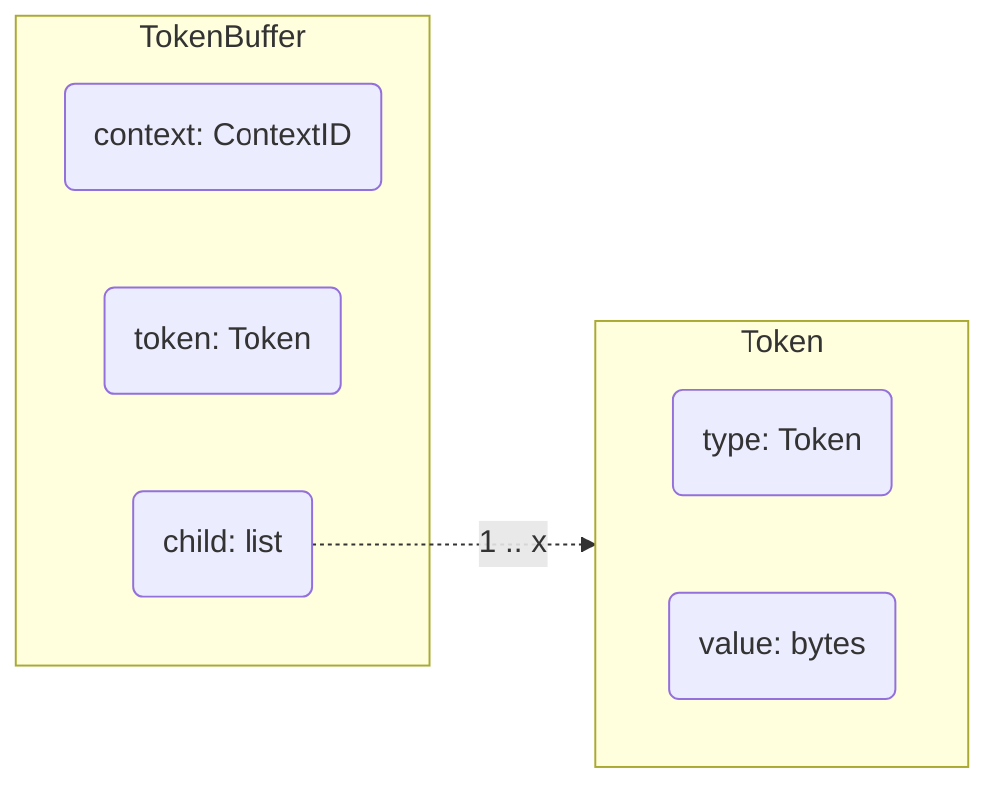

# TOKEN

## Type

### TokenBuffer

### Token

Token is represented by enum in python, [here](#list-of-token) the list of all Token with syntax

### ContextID

ContextID is represented vby hexadecimal format (`0x1`) in python, the range start to `0x1` to infinity.

> ⚠️ **Warning**:  the `0x1` ID represent the NULL context (start context)

## List of Token
>
> 📝 **Note**:
> <ul>[ ... ] &rarr; Optional</ul>
> <ul>{ ... } &rarr; One of all in scope is required </ul>

 

| TOKEN | SYNTAX |
|-------|--------|
|  VAR  |`x: number = 15`|
|  <ul>NAME</ul>  |`x`|
|  <ul>[ TYPE ]</ul>  |`number`|
|  <ul>VALUE</ul>  |`15`|
|  PRINT  |`print 15`|
|  <ul>{ VALUE }</ul>  |`15`|
|  <ul>{ VAR }</ul>  |`x`|
